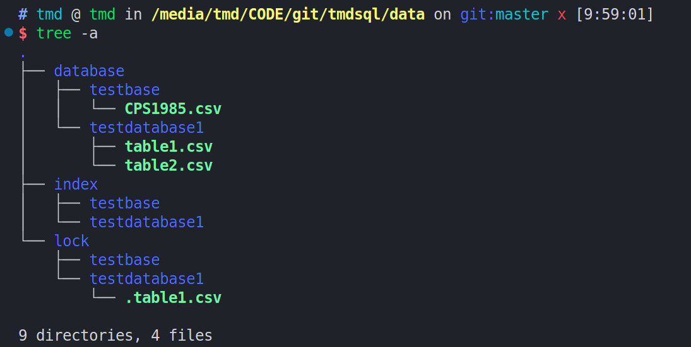

# TMDSQL
## 总体设计思路
- 无界面全终端操作方式,前端具有shell解析。并直接运行TMDSQL语句。
- 自定义中文TMDSQL语言,并实现该语言的语法检查,语义检查,转化为底层的C++代码并操作数据库。
- 创建数据库和数据库表,增删改查更新基本操作。
- 多用戶登录,读写上锁,视图层实现。
- 使用双级缓存进行数据读取。使得读取速度加快。
- 主键采取聚簇索引的底层形式。并采取缓冲形式进行查询速度的优化。

## 运行须知
- 本项目采用UTF-8的编码方式，而在UTF-8的编码方式中，一个汉字是三个字节。而项目编写时采取的环境是`gcc version 10.2.1 20210110 (Debian 10.2.1-6)`,linux中默认采取UTF-8的编码方式，如果采取windows系统，可能需要进行一些设置或者在编译的时候加上一些参数来将其设置为UTF-8.
## src目录及其主要功能介绍
### `dir.h && dir.cpp`
  > 主要实现目录操作，在内核中，目录对应于数据库，封装_dir类。
### `file.h && file.cpp`
  > 封装文件操作类_file,在内核中，文件对应表。
### `DataBase.h && DataBase.cpp` 
  > 保护继承_dir类，调用一些_file的静态函数以辅助实现对数据库本身的操作
### `table.h && table.cpp`
  > 保护继承_file类，封装一些对表本身的操作 
### `shell.h && shell.cpp`
  > 对中文TMDsql语句的封装
### `super.h && super.cpp`
  > 对所有公有函数，枚举量以及全局静态const常量的声明与定义。
### `Index.h && Index.cpp`
  > 封装对表索引操作的声明与定义
### `TablePCB.h && TablePCB.cpp`
  > 封装对表PCB操作的声明与定义
### `DataBase.h && DataBase.cpp`
  > 封装对数据库PCB操作的声明和定义
## data目录的结构
### database
  > 数据库存放路径，其子文件夹为各个数据库文件夹，文件夹名即为数据库名，而该文件夹内，为表名，不含后缀，可以拿记事本以UTF-8的编码方式打开，内置数据存放方式是以CSV方式存放。
### index
  > 索引文件存储路径，其子文件夹为各个数据库
## tablePCB的内容
1. name
2. nextIndex
  > 下一行的起始文件指针
3. length
  > 行数

## 数据文件存储方式

- 总体思路
> 对数据库的数据，我采取目录对应数据库，文件对应表的方式。除了数据库目录和表文件以外，我仿照Linux对于锁的建立，用'.'开头的隐藏文件同名文件建立锁，对于文件的读取，我采取字符型存取，大量数据的文件读取速度如果仅仅采取按行存取则会很慢，那么我借助文件指针的思想，建立索引文件，用来保存索引字段与文件指针的对于关系，以便于后期直接根据文件指针的位置随机存取。而索引文件本身很大，借助操作系统中的段页式文件，于是我建立二级索引文件以加快查询。而索引文件本身是有序的，采取二分折半查找的方式查询。