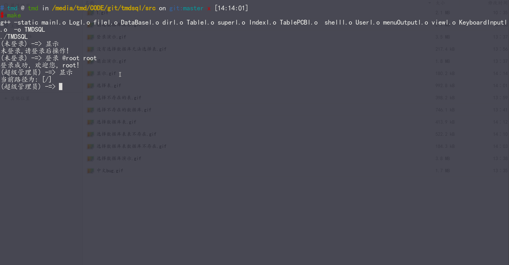
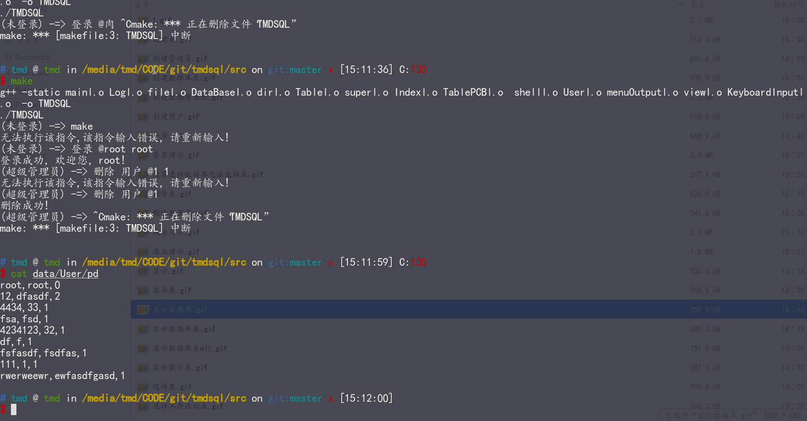

# TMDSQL_1.6(ing)

- gitee
<https://gitee.com/ttz_ztt/tmdsql>
- github
<https://github.com/ttzorztt/TMDSQL>

## 版本更替

- V(1.0)
    > 弱鸡版本，实现对数据库和表的简要增删查，和权限管理，前端自定义中文shell脚本编程。,甚么？你说甚么？简单增删改查？对的,这是菜需困版本。
  - bug记录: 对选择表指令作用不明显。
    - V1.1:已解决。添加若干结合pwd的指令。做到省略参数
- V(1.1)
    > 菜鸟版本,添加若干指令,对上一个版本的BUG进行修复，同时新增日志管理，更为详细记录shell的报错信息。有了日志管理,看起来似乎有那么点意思了。
  - bug记录: 日志显示有bug，没做到实时显示到文件里。
    - 操作系统中有个概念是内存何时写回磁盘。出现bug的原因就是没有实时写回磁盘，导致同时打开日志文件显示总比指令慢半拍。
    - V1.2:已解决。每写完一行，就强制写回磁盘
- V(1.2)
  > 吗卡巴卡版本,添加若干指令,对上一个版本的BUG进行修复，目标实现用户视图层，允许设置索引列(之前版本默认第一个字段是索引),顺便吐槽一下，加点新功能真的是要把我整服，逻辑不难，犄角旮旯的细节改到吐
  - bug记录：linux版本必须管理员身份才可执行。windows版本没有限制。
    - linux对于权限限制很高。后期查询资料,创建路径的权限是mkdir()和当前进程的mask值有关,
    - V1.3:已解决,添加umask函数, 将创建文件的权限修改至普通用户可以打开的权限,so,就不需要管理员权限执行了。厉害吧。
- V(1.3)
  > 修复版本,简单测试了一下,逻辑还是有些许bug,比如设置视图,设置索引,参数设置不对。果然应了那句话,代码五分钟,测试两小时。
  - bug记录： UTF-8中文是三个字节,GBK是两个字节,假设你在终端中输入多个汉字,按下退格键后,只会删除一个字节(或许是一个),但问题是OS似乎只允许你对一个汉字退格一次。导致你多次退格后留有汉字或乱码删不掉。(似乎只有高贵的(tmd)linux有这个BUG,windows巨流畅)
    - 功能优化: 添加方向键\<UP>和方向键\<DOWM>对命令的回溯,比如按下\<UP>就可以快捷显示上一次执行的指令。
    - 这个bug有些麻烦,先搁浅....战略性撤退
- V(1.4) -> 本科毕设版本
    > 优化版本,对查询算法的优化。对,就是那个号称纯暴力的查询,之前版本的查询做了一个索引表,存储两列,索引字符串和文件指针。查询的时候直接将查询索引文件,得到表的文件指针的时候,转根据文件指针查询表内容。暂时只能做一些优化。
  - 这个版本实现了Cache缓存,对查询以及修改会大幅度提高速度。对文件的查询,修改会同时对缓存和硬盘修改。Cache替换采用LRU(最近最久未被使用)算法,所以emmm,可以无脑使用Ctrl+C了。
  > 本来还想类似vim做一个.vim的隐藏文件,用于无脑非正常退出的情况下保存在缓存中的内容。但又觉得没有必要,这又不是文件编辑器,为什么要添加保存的功能?
- V(1.5)
  >差不多版本:似乎可能大概,emmmm我没有想到删除指定行和删除指定的列的前端。删除行的后端之前写过,这个版本浅浅写一下。
- V(1.6)
  >看起来似乎蛮牛版本:实现回溯功能,不需要类似虚拟机快照般的断点,类比git的回溯,git以上传作为断点,而TSQL以指令作为断点,指定指令中的断点进行回溯。
  - 回溯并非是与原数据库一模一样，比如原来删除某一行，回溯会将其插入到的数据库尾，比如删除某一列，回溯会将该列插入到表的最后一列等。
  - 修改记录: 我把'.'从违规字符中剔除出来了，在回溯功能中，需要走时间，比如2023.5.4，so我让'.'作为一个正常字符。(主要是懒得再重命名了)
  - bug记录:貌似登录后,从普通用户转root似乎权限提示符正常,但是root转普通用户权限提示符似乎有点问题(不过,正常Root,也不会去登普通用户吧) (已解决)
  - bug记录:上一个版本删除列的时候没有考虑视图层,需要视图层实现一个update(已解决)
	- 暂不对windows版本更新了,windows和linux一些底层接口不同,测试比较麻烦。等以后有windows的需求再更新。顺便说一下,之前的windows版本问题也很多,暂时就只更新linux版本。
	- 1.6BUG蛮多的,主要是没有测试,找到的逻辑问题很容易修改,但由于只有我一个人开发,so很多测试点测试不到。当下发现bug点比如：
	1. 当已有登录的情况下，登录密码错误不会报错
	2. 只输入第一个关键字后回车，输出乱了
	3. 用户登录后，执行插入指令报错
	但这是毕设版本,与毕设略有不同(回溯 显示 @time的输出花哨了一点,然后对底层_dir::openDirReturnFileName进行优化)。这些bug就留到1.7修改吧。毕竟也是本科四年的青春呢,稍微记录一下下,哇卡卡。
## 实现功能简要概述

- 对数据库的增删查功能的实现
- 对表的增删查的功能实现
- windows平台和linux平台均有发行版(Windows版本只是能跑,因为底层接口和Linux不同,而开发平台不是windows,所以测试很麻烦,总的来说,就是有windows版本,但是没经过测试很差劲很多bug。)
- 权限层
  - 用户数据记录在./data/User/pd文件内,每行包含用户名，用户密码，权限等级三项,而权限分为四类1.未登录2.用户3.管理员4.超级管理员Root

    > 不同的权限可以执行不同的操作。上级用户可以对下级用户进行增删，也就是说Root可以增删管理员和用户，管理员可增删用户，普通用户只能查询，增删需要管理员以及ROOT才可执行。显然限制用户行为是程序员唯一的乐趣。
- 前端shell解释层
  - 实现简单的解释，Shell是按照解释型语言编写，大概是好多好多条中文指令，分为10类。不同指令执行会在终端输出是否成功以及简要错误原因。同时会在日志中记录更为详细的原因。
    - 退出系

      > 只有一条指令，执行就会bye-bye
    - 选择系

      > 如果选择了数据库，后期建表或删表等操作的指令可以省略数据库参数，同样如果选择了表，后期对表的指令同样可以省略表对应的参数,但如果你非要说，哎，我就不选，就是玩，那我只有大喊一身，靓仔。
    - 显示系

      > 对数据库所存储的表，或表的内容进行显示。话说，我还没想好还能显示什么。
    - 登录系

      > 系统权限划分很严格，不同权限下允许执行的指令不同。不登录你只能含泪说bye-bye
    - 执行系

      > 主要为了实现脚本化编程，另外建立一个txt文件，如果你说,哎,我就建一个.bat文件,我还是会按照txt格式解析,emmmm,应该是不能带后缀,因为'.'似乎被我定义成违法字符了。包含若干指令，使用执行系指令可以直接执行脚本，那不得高大上起来，别的小孩都有脚本，咱们也得安排上
    - 创建系

      > 对数据库，表，用户，管理员的创建，emmm，你配吗？先看看自己的权限再说
    - 删除系

      > 对数据库，表，用户，管理员的删除，emmm，我不配，一个路过的普通用户说
    - 插入系

      > 对表内容插入，emmmm，起名恐惧症
    - 查询系

      > 根据索引进行搜索，查询优化算法？纯纯纯纯暴力好吧(说是暴力,起码建立查询索引表了。。)
    - 设置系

      > 高级boy，索引，视图的设置
    - 回溯系

      > 同样是高级emmm,高级girl,可以类比git的回退版本
- 日志层
  - **日志系统中的运行错误与终端输出不同，是两套显示集，日志记录的更为详细**
  - 日志按照日期划分，会自动记录当前的时间和日期，按照日期建立日志文件，在底层实现的时候，对不同的错误情况进行了详细分类，分为好多种不同的错误情况。(在文章后面有详细情况划分)
- 索引层(查找逻辑)(菜鸡大四毕设，误喷)
  - 查找逻辑很简单，简单做了一个索引，在C++中又一个参数是文件指针(其他语言不太了解名词)，逻辑上文件是二维的，底层实际上是一维存储，那么文件指针就是一维的下标。接下来我从逻辑上解释，假设我们现在表内有很多行数据(默认首列是索引，后期可以指定)，我重新建立index文件夹，其文件结构与dadabasae文件结构相同，内容分为两个字段，一个是索引，一个是表中该行开头的文件指针。查询指令执行的时候，就会直接访问index文件系统，查找对应的行的文件指针，重新打开对应的表，直接跳转到该行。
  - 这种查找逻辑，适合每行数据很多的情况，如果一行数据并不多，其实效率也不高。
- 脚本层
  
  > 支持脚本编程，即不需要用户在终端中一条一条执行，将指令写在一个文件中，每行存储一条指令，主要中间不允许空行(会认为文件结束)。把该文件放在./data/SQL/路径下，使用指令 `执行 @SQLName`执行。emmm，当然要提醒一下靓仔，你需要放在./data/SQL路径下才能使用，别说为什么不能用相对路径或绝对路径，如果你要听假话的话，我可以告诉你，是因为TMD(没有骂人，回到标题你就会发现名字就叫这个)数据库是支持linux和windows双系统的，你要是绝对路径就很麻烦，而且我怕你傻了吧唧删我别的路径的文件。但你要是想听实话的话，哎，其实这些都不是问题，解决的话也不难，就是懒，毕竟折腾用户才是最快乐的。
- PCB层
  
  > 所有表项均有对应PCB文件，存放在./data/PCB/中，该文件夹和database分布相同。记录一些需要的表属性。emmm，毕竟要展示一下是学过OS滴。(不好，快跑,让他装到了。)
- 视图层
  
  > 在./data/view文件夹中，同样与database分布相同，每行保存数据为: \[用户名\] allowCol1 allowCol2 ...,就是记录小趴菜允许访问的列。注意,普通小趴菜默认是什么也访问不了的。默认视图为空。单如果你属于管理员级别的高级趴菜,就不存在视图了,直接全emm,去除马赛克,就是都能看。
- 回溯层

  > 同样该系指令需要管理员及以上权限执行。原理就是在用户执行每一条指令的同时(倒不如只记录修改指令),重新建立一个文件去记录其相反操作,比如你执行删除操作,哎,我就在这个文件里记录同名创建操作,然后呢,按照脚本执行的思路进行回退。

## 运行须知

  > 根据系统版本划分为两个，Linux(Debain11)版本，Windows(Windows10专业版)两个版本，下载前请先查看Readme，获得TMDSQL所支持的语法。该可执行文件首先会生成一些辅助文件，会在当前目录生成data文件夹，存放一些辅助文件。系统预置超级管理员，帐号为:root,密码为root,具体可见User文件夹下的pd文件。所支持的语句或功能需要查看备注，特别标出的是最新功能，上一个版本可能不支持。如需要最新版本(可能跑不通，因为还没写好)，需要下载源码进行make编译。(放心吧，这段话可以跳过，下载源码？能将readme看到现在的人估计都没几个)

- 编译系统环境是在linux(Debain)中，gcc的版本是:`gcc version 10.2.1 20210110 (Debian 10.2.1-6)`,进入源码后，使用

  ```bash
  make
  ```
  
  指令可以生成linux版本的TMDSQL
- 附带版本windows，是在linux(Debain)采取交叉编译的方式，需要首先下载交叉编译链:

  ```bash
  sudo apt install mingw-w64*
  ```

  进入源码后，使用

    ```bash
    make TMDSQL.exe
    ```

  即可得到windows版本的TMDSQL.exe

### 编码

#### Windows版本(Windows 10专业版)

  > 本项目的windows版本采取GBK的编码方式，您需要查看您所使用的终端的编码方式,使用如下代码:(如果你是python用户，你确实需要查看一下,因为高端的python用户经常会修改该字段)

  ```cmd
  chcp
  ```

  >如果返回 `936`,则说明您当前系统所采取的编码方式是GBK。那么就不需要进行修改。但如果您返回的是其他编码方式，则需要进行编码设置，您可以使用如下命令:

  ```cmd
  chcp 936
  ```

  >来暂时设置，以便于使用该数据库。至于我采取GBK作为windows版本的编码，是因为windows默认采取的编码方式是GBK，但还是需要进行验证，以便于执行时出现乱码。emmmm，出现bug再说

#### Linux版本(Debain 11)

- 本项目采用UTF-8的编码方式，而在UTF-8的编码方式中，一个汉字是三个字节。而项目编写时采取的环境是`gcc version 10.2.1 20210110 (Debian 10.2.1-6)`,linux中默认采取UTF-8的编码方式。

## data目录的结构

> 系统运行前会调用初始化函数，so这是初始化之后的结果

### database

  > 数据库存放路径，其子文件夹为各个数据库文件夹，文件夹名即为数据库名，而该文件夹内，为表名，不含后缀，可以拿记事本以UTF-8的编码方式打开，内置数据存放方式是以CSV方式存放。但不建议你自己写一个UTF-8的文件放进去冒充表，因为系统没有你想象的那么简单，pcb记录文件数据，index记录每行索引，你直接放进去，必将查询不到。

### index

  > 索引文件存储路径，其子文件夹为各个数据库文件夹，而在数据库文件夹中，并非存放表，而存放表的索引文件，命名方式与表名相同。建议不要瞎改，会出bug的

### PCB

  > PCB文件存储路径，其子文件夹为各个数据库文件夹，而在数据库文件夹中，存放表PCB文件。命名方式与表名相同。听这名字，势必就是学过操作系统的

### Log

  > 日志文件存储路径，其内容为总日志记录，本来想着要不就整一个文件，但是想着万一发扬光大，还是按照时间存储

### SQL

  > 存放需要执行SQL脚本，不需要后缀名

### User

  > 只有一个文件pd，存放帐号密码信息。当然是明码了，你个锁黑，没事搞什么加密算法干嘛。

### View

  > 视图层，指定用户可看到的列，如果不指定，就看不到了。(那当然是对普通用户而已，但凡你的权限是管理员，或者更为牛气的Root，虽然可以给你指定视图层，但是昂，底层直接绕过，查询到你是尊贵的VIPPPPPP用户，直接全部显示)

### Back

  > 回溯层, 用于存储回溯文件。其实现的本质就是记录所有修改的指令的反指令,比如执行创建,这里记录删除指令。然后记录每条指令的序号,按照伪脚本的方式执行。

## tablePCB的内容

- name

  > 就是表名而已
- nextIndex：下一行的起始文件指针

  > 似乎这个参数，emmmm，也没有什么实际意义
- length：行数
  
  > 实际上这个参数在代码逻辑内没有意义，但暂时记录着，万一之后有什么说法呢？
- indexcol: 索引列
  
  > 如果你懒的设置索引的话，默认就是0，第一列就会是索引

## shell语言解释器

## PWD

- pwd = `[]`,默认状态，说明当前未选择数据库，且未登录。此种状态不可以执行除去登录外的任何指令,均会输出:
  
  ```txt
  (未登录) -=> 未登录,请登录后操作!
  ```
  
- pwd = \["/"\],说明当前已经登录，并未知帐号信息，且没有选择数据库
- pwd = \["/"\]\["测试数据库1"\]， 说明当前已经登录，且已经选择一个名叫测试数据库的数据库。
- pwd = \["/"\]\["测试数据库1"\]\["测试表1"\]，说明当前已经登录，且当前已经选择测试数据库1下的测试表1

## 用户权限管理

`OP` 为权限值，分为四种权限

- `OP`=0 为Root权限

    ```txt
    pwd = ["/]
    ```

- `OP`=1 为管理员权限
  
  ```txt
  pwd = ["/"]
  ```
  
- `OP`=2 为普通用户权限
  
  ```txt
  pwd = ["/"]
  ```
  
- `OP`=3 为未登录权限
  
  ```txt
  pwd = []
  ```

> 权限显而易见是ROOT > 管理员权限 > 普通用户权限,而不同权限，可以做不同的操作，简单来说，普通用户只有查询和一些查看内容的操作，一切对于数据库的修改，比如数据库的创建，数据库的删除，表的创建，表的删除等必须具有管理员或超越管理员的权限，同时管理员具有添加删除普通用户的权限。而ROOT作为超级管理员，可以添加删除管理员帐号。

## 用户提示符

用户提示符只能显示权限，并不会显示用户名，只体现你尊贵的身份，并不鸟你是谁。

### 未登录

  ```txt
  (未登录) -=>
  ```

### 普通用户

  ```txt
  (用户) -=>
  ```

### 管理员

  ```txt
  (管理员) -=>
  ```

### 超级管理员

  ```txt
  (超级管理员) -=>
  ```

## 支持语句（44）

  > 总体来说，TMDSQL支持中文，且关键字之间用`空格`隔开，结尾没有封号，每条指令必读独立占据一行。

- **以下对于指令介绍，由于未知用户权限，将未知用户的用户提示符改为`(?) -=>`**
- **加粗字体为关键字，斜体为用户输入随意字符串,需要使用@开头，后面的则不需要**
- 未登录用户只允许执行`登录`、`退出`和`执行`指令，其余指令均会拒绝执行并输出：
  
  ```txt
  (未登录) -=> 未登录,请登录后操作!
  ```

### **`退出`**(1)

- 使用`退出`指令，会结束SQL执行。并输出:
  
  ```txt
  已退出!
  ```


### **`选择`**(3)

- **选择** **数据库** _@测试数据库1_
  
  - 若数据库不存在
  
    ```txt
     目标数据库不存在!
    ```

    - 
  - 正常情况
    - 
- **选择** **表**  _@测试表1_
  - 没有选择数据库，则无法选择，提示:

    ```txt
    该指令无法执行，没有选择数据库!
    ```

    - 
  - 已经选择数据库，且已经选择的数据库中有没有测试表1,提示:

    ```txt
    无法执行该指令，该数据库中不存在此表
    ```

    - 
  - 正常情况
    - 
  - 已经选择数据库，且已经选择的数据库中有没有测试表1,提示:

    ```txt
    无法执行该指令，该数据库中不存在此表
    ```

    - 
  - 正常情况
    - 
- **选择**  **数据库**  **表**  _@测试数据库1_  _测试表1_
  - 若测试数据库1不存在，则提示:

    ```txt
    目标数据库不存在!
    ```

    - 
  - 如果测试数据库1中没有测试表1，则显示:

    ```txt
    无法执行该指令，该数据库中不存在此表
    ```

    -
  - 正常
    -

### **`显示`**(6)

- **显示**
  
  - 使用`显示`指令，根据当前的pwd分为四种情况：
    - pwd = []  
  
      ```txt
      (未登录) -=> 未登录,请登录后操作!
      ```
  
    - pwd = ["/"]
  
      ```txt
      (?) -= > 当前路径为: /
      ```
  
    - pwd = \["/"]\["测试数据库1"]
  
      ```txt
      (?) -= > 当前路径为: /测试数据库1
      ```

    - pwd = \["/"]\["测试数据库1"]\["测试表1"]
  
      ```txt
      (?) -= > 当前路径为: /测试数据库1/测试表1
      ```

  - 
- **显示**  **数据库**
  - 该指令需要登录后可使用。显示当前系统中所有数据库。假设当前数据库内有DB1,DB2,DB3三个数据库，则使用该指令后显示:

    ```txt
     #######
     ? DB1 ?
     ? DB2 ?
     ? DB3 ?
     #######
    ```

  - 
- **显示**  **数据库**   _@DBID_(=pwd[1])
  - 该指令需要登录后使用，可以选择到表后使用该指令，效果可以显示指定数据库中所存的表。
    - 当该数据库不存在时:

    ```txt
    数据库不存在!
    ```
  
    - 当该数据库为空的时候:

    ```txt
    这个数据库是空的!
    ```

    - 当这个数据库有TB1,TB2,TB3三张表的时候：

      ```txt
      *******
      | TB1 |
      | TB2 |
      | TB3 |
      *******
      ```

  - 
- **显示** **表** @_showNumber_
  - 该指令需要首先选择数据库且选择表，显示showNumber行，也就是说`pwd.size() ==  3`
  - 
- **显示**  **表**  _@TBID_ _showNumber_
  - 该指令需要首先选择数据库，然后默认在该数据库下查询表的内容，_showNumber_ 是显示的行数，也就是说`pwd.size() >= 2`
  - 如果执行这条语句之前没有`选择`数据库，那会提示:

  ```txt
  该指令无法执行，没有选择数据库!
  ```

  - 如果已经选择数据库，但选择的数据库内没有该表，会提示:

  ```txt
  无法执行该指令，该数据库中不存在此表!
  ```

  - 如果一切顺利，已选择数据库，且选择的数据库内有该表，则会正常输出。
  - 
- **显示**  **数据库**  **表**  _@DBID_ _TBID_ _showNumber_
  > 显示DBID下的TBID的前showNumber行
  - 

### **`登录`**(1)

- **登录**  _@帐号_  _密码_
  - 登录成功:

    ```txt
    (?) -= > 登录成功，欢迎您,帐号!
    ```

  - 登录失败:
    - 帐号不存在:

      ```txt
      帐号不存在,登录失败!
      ```

    - 密码错误:

      ```txt
      密码错误,登录失败!
      ```

  - 

### **`执行`**(1)

- **执行**    _@脚本名_
  > path是执行SQL语句的脚本文件。编码格式无论是windows系统版本还是linux版本，均需要采取UTF-8的编码格式。

  - 如果当前目录不存在该脚本,则会输出:

    ```txt
    无法执行该指令，目标脚本不存在!
    ```

- **注意: 需要将脚本放置于./data/SQL目录下，然后使用如上指令，脚本名需要是放置在SQL的全称，带后缀的那种。如果代码中间存在空行，会跳过空行后的内容，结束执行**

  - 

### **`创建`**(5)

- **创建**  **用户**  _@ID_  _Password_

  > 该指令需要OP < 2,也就是需要管理员权限或者超级管理员ROOT权限才能执行。该指令会添加密码为Password的普通用户ID
  - 当用户ID存在时，提示:

  ```txt
  该用户已存在，无法添加!
  ```

  - 创建成功后提示:

  ```txt
  创建成功!
  ```

  - 
- **创建**   **管理员**   _@ID_ _password_
  > 该指令需要OP < 1,也就是需要超级管理员ROOT权限才能执行。会添加密码为password的管理员ID。
  - 当用户ID存在时，提示:

  ```txt
  该用户已存在，无法添加!
  ```

  - 创建成功后提示:

  ```txt
  创建成功!
  ```

  - 
- **创建**  **数据库**  _@DBID_
  
  > 该指令需要OP < 2,也就是管理员或超级管理员ROOT权限才可以执行。会创建名为DBID的数据库。
  - 如果DBID存在，则提示:
  
  ```txt
  无法执行该指令，目标数据库已存在!
  ```
  
  -如果DBID不存在，则执行成功，提示:
  
  ```txt
  创建成功!
  ```

  - 
- **创建** **数据库** **表** _@DBID_ _TBID_

  - 
- **创建**  **表**  _@TBID_
  > 该指令需要OP < 2，也就是管理员或超级管理员权限才可执行。但在此之前需要选定数据库。
  - 如果没有选择数据库的话会输出:

  ```txt
  该指令无法执行，没有选择数据库!
  ```

  - 如果已经选择数据库，但表TRID已存在，那会提示:

  ```txt
  无法执行该指令，目标表已存在!
  ```

  - 如果一切顺利，则显示:

  ```txt
  创建成功!
  ```

  - 

### **`删除`**(11)

> 该指令需要管理员或者超级管理员权限才可执行。谨慎使用！针对不同的指令，系统将变着花样提示。

- **删除**  **数据库**  _@DBID_
  >该指令会删除名为DBID的数据库。执行首先会判断DBID存在与否，如果存在，系统将首先输出该数据库中存在的所有表，然后需要用户键入"确认"才可删除。
  - 如果数据库DBDI不存在，则会提示:

  ```txt
  目标数据库不存在!
  ```

  - 如果DBID是一个空数据库，那么就直接删除，并不需要输入确认:

  ```txt
  删除成功!
  ```

  - 如果DBID是一个非空数据库，且其中有表TB1，TB2，TB3和TT三张表，如果执行指令，则显示:

  ```txt
  数据库并不为空，以下为当前存在的表项
  *******
  | TB1 |
  | TB2 |
  | TB3 |
  | TT  |
  *******
  如果您仍然执意删除，请键入 "确定" :
  ```

  - 此时你需要在':'后键入确定。
    - 如果你没有输入`确定`而输出别的(包括只输入回车)，则会提示:

      ```txt
      该指令已取消!
      ```

    - 如果你输入`确定`,则会提示:

      ```txt
      删除成功!
      ```

  - 
- **删除**  **表**  _@TBID_
  > 该指令会删除名为TBID的表，当然执行该指令的前提是你首先得选择到数据库，系统会判断当前pwd的路径，如果pwd.size() > 2,且pwd[1]中有该表，系统会输出该表当前的前五行，然后同样需要用户键入"确认"才可删除。
  - 如果你没有选择数据库，则会提示：

  ```txt
  该指令无法执行，没有选择数据库!
  ```

  - 如果已选数据库，但pwd[1]中没有表TBID,则会提示：

  ```txt
  目标表不存在!
  ```

  - 如果存在，但表为空，执行会提示:

  ```txt
  删除成功!
  ```

  - 如果存在，且不为空的情况下，执行后提示:

  ```txt
  表不为空，以下是该表的一部分内容:
  测试1 测试2 测试3 
  测试1 测试2 测试3 
  如果您仍然执意删除，请键入 "确定" :
  ```

  - 此时你需要在':'后键入确定。
    - 如果你没有输入`确定`而输出别的(包括只输入回车)，则会提示:

      ```txt
      该指令已取消!
      ```

    - 如果你输入`确定`,则会提示:

      ```txt
      删除成功!
      ```

- **删除**  **数据库**  **表**  _@DBID_  _TBID_
  > 该指令会删除DBID下的TBID，首先判断DBID是否存在，且是否有TBID这张表，其实和上一个指令差不多，是将上一个指令中默认的pwd[1]修改为DBID执行而已。
  - 和上一条指令类似。
  - 
- **删除**  **用户**  _@UserName_
  > 该指令会删除名字为UserName的普通用户。
  - 当UserName不存在时，提示:

  ```txt
  该用户不存在!
  ```

  - 当与用户存在的时候，提示:

  ```txt
  删除成功!
  ```

  - 
- **删除**  **管理员**  _@managerID_
  > 该指令需要超级管理员ROOT权限才能执行。
  - 当managerID不存在时，提示:

  ```txt
  该管理员不存在!
  ```

  - 当与用户存在的时候，提示:

  ```txt
  删除成功!
  ```

  - 
- **删除** **行** **数据库** **表** _@DBID_ _TBID_ _Row_

  > 删除行,emmmm不知道咋介绍这一行,感觉顾名思义应该可以差不多大概知道怎么用吧。是,肯定得Root或管理员才能执行。
- **删除** **列** **数据库** **表** _@DBID_ _TBID_ _Col_

  > 与上一条指令类似,就是用来删列的。
- **删除** **行** **表** _@TBID_ _Row_

  > 与上emm,两行类似,就是缩写指令,但前提你得给我缩写的资格,就是你得先用选择指令选择数据库,然后我才可以从pwd[1]中提取到你选择的数据库,然后emmm,不过估计你也不在乎到底怎么实现的。反正你要用这条指令,就得乖乖的选择数据库,但是你说,哎,我偏要选择到表,那我只能说,emmm,就像我要你去买菜,然后你回答饭已经做好了,那我直接谢谢你。还得夸你真懂事。
- **删除** **列** **表** _@TBID_ _Col_

  > 与上一个和上两个类似,emmm就是选择到表才可以,要不然我怎么知道你要操作哪个数据库的这个表。没办法,靓仔你就配合一下。如果你非要说,我就是我,不一样的我,就爱用那种既指定数据库,又指定表的指令。要是所有用户都像你一样懂事,那我确实可以少很多事。
- **删除** **行** _@Row_

  > 没办法再省略了,你选择到表我知道你要操作这张表,但你起码得给我说你是删行还是删列。是删那一行还是那一列是吧。
- **删除** **列** _@Col_

  > 怎么说呢,没啥好说的。

### **`插入`**(3)

- 
  
  > 该指令同样需要管理员权限或超级管理员权限
  
- **插入** _[value1_ _value2_ _...]_
  > 该条指令需要用户选择到表，一切顺利的情况下，尾插value1，value2等数据。
  - 当未选择数据库的时候，会提示:

  ```txt
  该指令无法执行，没有选择数据库!
  ```

  - 当选择数据库但没有选择表的时候，
- **插入** **表** _@TBID_ _[value1_ _value2_ _...]_
  > 该条指令会在选择数据库，且该数据库内有TBID后可执行，尾插value1，value2等数据。
  - 当未选择数据库的时候，会提示:

  ```txt
  该指令无法执行，没有选择数据库!
  ```

  - 当已选择数据库，但pwd[1]中没有该表，则会显示:

  ```txt
  目标表不存在!
  ```

  - 当一切顺利，则会显示:

  ```txt
  插入成功!
  ```

- **插入** **数据库** **表** _@DBID_ _TBID_ _[value1 value2 ...]_
  > 该指令是上一条的扩展，无需先选择数据库，只要参数正确，指定数据库下的表尾插入指定集合即可。
  - 当数据库DBID不存在时，会提示:

  ```txt
  目标数据库不存在!
  ```

  - 当表不存在的时候,会提示:

  ```txt
  无法执行该指令，该数据库中不存在此表!
  ```

  - 当一切顺利，则会显示:

  ```txt
  插入成功!
  ```

### **`查询`**(3)

- 

> 仅需登录，不查询权限等级

- **查询**  _index_
  
  > 需要选择数据库，选择表，即pwd.size() > 2
  
- **查询** **表** _@TBID_ _index_
  > 需要选择数据库，即pwd.size() > 1,pwd[1]中有表TBID，查询索引为index的内容。
  - 如果执行前没有选择数据库，则会显示:

  ```txt
  该指令无法执行，没有选择数据库!
  ```

  - 如果选择数据库后，但目标数据库内没有表TBID，则会显示：

  ```txt
  目标表不存在!
  ```

  - 如果TBID存在，但index并不在表TBID中，则会显示:

  ```txt
  搜索结束，没有搜到目标值!
  ```

  - 如果index存在，则会返回搜索到的值。

- **查询** **数据库** **表** _@DBID_ _TBID_ _index_
  > 不需要选择数据库，属于权限最小的一系列指令，只需登录即可执行。查询DBID下的TBID中索引为index的内容。
  - 数据库DBID不存在,则会输出:
  
  ```txt
  目标数据库不存在!
  
  ```

  - 数据库DBID存在，但是表TBID不存在，则会输出:

  ```txt
  目标表不存在!
  ```

  - 数据库DBID存在且表TBID存在，但是没有搜到Index，则会输出：

  ```txt
  搜索结束，没有搜到目标值!
  ```

  - 如果搜到，则会正常显示搜索内容。

### **`设置`**(6)

> 该系指令是用来设置一些表特性，比如设置索引，或约束用户建立视图层，该系指令只允许管理员以上权限执行
> 懒得写例子了，将就着看吧。

- **设置** **视图** **数据库** **表** _@DBID_ _TBID_ _UserName_ _[value...]_

  > 就是设置视图的指令,指定数据库和表后,对于指定的用户UserName,然后设置允许访问的列。
- **设置** **视图** **表** _@TBID_ _UserName_ _[value...]_

  > 是上一个指令的省略指令,需要在指定数据库的情况下,指令中只需指定到表,然后对于用户UserName,设置允许访问的列。
- **设置** **视图** _@UserName_ _[value...]_
  > 是上一个指令的省略,需要指定数据库和表,然后对指定的用户UserName,设置允许访问的列。
  - 
- **设置** **索引** **数据库** **表** _@DBID_ _TBID_ _indexColumn_

  > 是用来设置索引,默认索引就是第一列,也就是主键的意思。只不过没有创建唯一主键,用索引来代替。实际上只会查询到第一个匹配的。指定数据库和表后,设置该表的索引列。设置后会自动更新索引文件。
- **设置** **索引** **表** _@TBID_ _indexColumn_

  > 是上一个指令的缩写指令,同样需要先使用选择指令,选择数据库后,然后选择表,设置该表的索引列。同样会自动更新索引文件。
- **设置** **索引** _indexColumn_
  > 是上一个指令的缩写指令。同样需要先使用选择指令选择到数据库和表,然后再指定该表的索引列。同样会更新索引文件。
  - 

> 这里可能看的有点懵,查看data文件夹其实是代码逻辑,忽视即可。对于视图而言,在./data/view/DBName/TBName文件内存储,第一列存储用户名,第二列开始存储视图。可以给管理员设置视图,但其实代码逻辑在查询的时候,权限大于管理的时候,就绕过视图层了。还有就是索引,索引我将其存储在pcb中,即./data/PCB/DBName/TBName文件中。

### **`回溯`**(4)

> 该指令是用来执行回溯操作，回溯之前的状态。同样回溯指令因为属于修改指令，所以同样需要管理员或超级管理员才可执行。

- **回溯** **显示**

  > 显示当前的回溯文件

- **回溯** **显示** _@time_

  > 显示指定回溯文件的内容

- **回溯** _@time_ _indexNumber_

  >  执行指定回溯点

- **回溯** **清理**

  > 清理回溯文件(**谨慎**)

## 日志系统

  > 建立Log类，实现日志的记录。日志自动生成,文件存储在./data/Log/xxxx,其中文件名是`年.月.日`.以下是一个简单例子:
  

- 按照日期划分文件
- 任何调用记录，均会在log文件夹内显示。log文件夹内存储LOG文件，记录所有操作内容，以及执行结果，包括但不限于:
  - 系统登录时间以及登出时间
  - 用户操作内容以及成功与否

- 日志内容(三行)：
  - 是否执行成功("V" or "X"),时间(包括日期和时间)
  - 失败原因(如果成功则输出顺利执行)
  - 执行人:执行指令(对一些缩写指令进行扩充。避免查看上下文)

- 日志记录项
  - 系统初始化(系统初次使用)
  - 登入系统(打开系统)
  - **指令记录**
  - 登出系统(关闭系统)

- 指令记录详解
  
  ```txt
  < 1 > [2] (3)
  4
  5{6} -=> 7
  ```

  1. 执行是否顺利(V或X)
  2. 日期
  3. 时间
  4. 执行细则(是否顺利，顺利的话显示"顺利执行"，否则显示错误内容)
  5. 权限等级
  6. 用户名
  7. 执行内容(包括指令和数据)
  
  - 比如:
    - 使用指令`执行 @SQL`,而SQL中的内容为:

      ```txt
      登录 表 @root root
      选择 数据库 @DB1
      ```

    - 那么日志记录内容将类似于:
  
      ```txt

      [2023.1.15] (15:5:26) 登录系统

      < V > [2023.1.15] (15:5:26)
      顺利执行
      未登录{未登录} => 执行 "SQL"

      < X > [2023.1.15] (15:5:26)
      未知指令
      未登录{未登录} => 登录 表 root root 

      < X > [2023.1.15] (15:5:26)
      未登录拒绝执行
      未登录{未登录} => 选择 数据库 DB1 

      [2023.1.15] (15:5:26) 登出系统

      ```

    - 而如果SQL中记录的是:

      ```txt
      登录 @root root
      选择 数据库 @DB1
      ```

    - 那么Log中将会记录:

      ```txt
      
      [2023.1.15] (15:6:5) 登录系统

      < V > [2023.1.15] (15:6:5)
      顺利执行
      未登录{未登录} => 执行 "SQL"

      < V > [2023.1.15] (15:6:5)
      顺利执行
      未登录{未登录} => 登录 用户"root" 密码"root"

      < V > [2023.1.15] (15:6:5)
      顺利执行
      超级管理员{root} => 选择 数据库"DB1"

      [2023.1.15] (15:6:5) 登出系统

      ```

    - 由于是SQL文件中的语句，所以时间是连续的，如果不执行`执行 @SQL`改为一条一条输入，那么时间将会不连续。
- 日志报错类型
  - **日志记录报错与终端输出是两套内容，日志更为详细**
  - 顺利执行

    > 默认值，表示一切正常执行。
  - 键入不存在的关键字

    > 系统是按照解释型设计，区分是否为关键字，是按照@符号区分，在@前面所出现的字符，均为关键字，而在@之后的内容，都是用户自定义的内容。
  - 键入违规字符
    - 违规字符集:
  
      ```c++
      static std::unordered_set<char> checkErrorName{
      '`', '~', '!',  '@',  '#', '$', '%', '^', '&', '*', '(',')', '_', '-',  '=',  '+', '[', ']', '{', '}', '|', '\\',':', ';', '\'', '\"', ',', '<', '>', '?', '/'};
      ```
  
    - 故用户需要避开这些非法字符
  - 登录帐号错误

    > 顾名思义，使用登录指令`登录 @ID Password`的时候，ID必须是在./data/User/pd文件内保存的ID，如果需要新建登录用户，可以使用系统默认的超级管理员帐号ID:root,Passoword::root登录，然后使用`新建 用户 @ID password`指令。或建造管理员用户，使之新建用户。
  - 登录密码错误

    > 使用登录指令的时候，密码输入错误。
  - 无法选择不存在的数据库
    > 这里的不存在其实有两种意思，一种是选择了不存在，一种是没有选择
    - `创建 表 @TBID`

      > 没有选择数据库
    - `选择 数据库 @DBID`

      > DBID不存在
    - `选择 数据库 表 @DBID TBID`

      > DBID不存在
    - `设置 索引 数据库 表 @DBID @TBID index`
  - 未登录拒绝执行

    > 刚进入系统的时候，系统处于`未登录`的状态，在这个状态下，用户只能使用`登录`,`退出`,`执行`三类指令。其余指令不允许执行，一旦执行就会报错。
  - 普通用户违规操作
    - `创建`

      > 创建系列指令普通用户无权执行。管理员和超级管理员有权限执行，但注意的是，管理员没有权限添加管理员用户等，不允许平级操作
    - `删除`

      > 删除系列指令普通用户无权执行。管理员和超级管理员有权限执行，但注意的是，管理员没有权限删除管理员用户等，不允许平级操作
    - `设置`

      > 设置系指令是属于高级指令，如果你是普通用户的话，emmm，bye了个bye
  - 未选择数据库越级选择表
    - `选择 表 @TBID`

      > 使用该指令之前没有选择数据库
    - `创建 表 @TBID`

      > 使用该指令之前没有选择数据库
    - `删除 表 @TBID`

      > 使用该指令之前没有选择数据库
    - `插入 表 @TBID`

      > 使用该指令之前没有选择数据库
    - `查询 @index`

      > 使用该指令之前没有选择数据库
    - `查询 表 @TBID index`

      > 使用该指令之前没有选择数据库
    - `显示 表 @TBID showNumber`

      > 使用该指令之前没有选择数据库
  - 已选择的数据库中不存在目标表
    - `选择 表 @TBID`

      > pwd[1]中没有TBID
    - `删除 数据库 表 @DBID TBID`

      > DBID中没有TBID
  - 第一个关键字错误

    > 指令所包含的第一个关键字，虽然是关键字但并非合法开头关键字，比如`用户`开头，虽然是关键字，但不允许开头。
  - 第二个关键字错误

    > 类比于上一个，第二个关键字虽然是关键字，但语义不通，比如: 正常的:`创建 数据库 @DBID`，如果你写成`创建 登录 @DBID`,那就会触发这个
  - SQL文件未找到
    - `执行 @SQLname`
      
      > SQLname在`./data/SQL/`内不存在，会触发这个
  - 编译错误
    
    > 这是纯纯瞎写，比如正常的`登录 @root root`,你给写成 `@root root`,说实话我猜也猜不出来你要干嘛。
  - 创建已存在的用户
    - `创建 用户 @UID UPassword`
      
      > UID在`./data/User/pd`文件内已存在，但这里并不区分该ID是管理员ID还是用户ID
  - 创建已存在的管理员
    - `创建 管理员 @UID UPassword`
      
      > UID在`./data/User/pd`文件内已存在，但这里并不区分该ID是管理员ID还是用户ID
  - 管理员违规操作
    > 管理员同级操作会触发这个BUG
    - `创建 管理员 @UID UPassword`
      
      > 管理员权限不允许执行该操作
    - `删除 管理员 @UID`
      
      > 管理员权限不允许执行该操作
  - 表已存在无法创建
    - `创建 表 @TBID`
      
      > 表都已经有了自然不让你瞎搞了
  - 数据库已存在无法创建
    - `创建 数据库 @DBID`
      
      > 说实话，这个的原因就和前一个一样一样的
  - 表不存在无法删除
    - `删除 表 @TBID`
      
      > 这个原因，emmm，其实你也懂。
    - `删除 数据库 表 @DBID TBID`
      
      > 这个就不用我解释了吧
  - 数据库不存在无法删除
    - `删除 数据库 表 @DBID TBID`
      
      > 如果连DBID都不存在，你准备要干嘛
    - `删除 数据库 @DBID`
      
      > 发挥一下你没什么用的脑袋，应该知道这是啥意思
  - 目标用户不存在无法删除
    - `删除 用户 @UID`
      
      > 删除空气?
  - 目标管理员不存在无法删除
    - `删除 管理员 @UID`
      
	    > 你准备要干嘛？二刷空气?
	- 输入非确定指令取消
    > 这个有必要解释一下，就是如果你删除的数据库或者表是非空的，那么就需要你输入`确认`来防止你眼瞎误删，同时会输出当前对象内存在的东西，如果你还是不懂是什么意思的话，那就联系厂家，换号重开吧。
	  - `删除 数据库 @DBID`
    - `删除 表 @TBID`
    - `删除 数据库 表 @DBID TBID`
  - 数据库不存在无法插入数据
    - `插入 数据库 表 @DBID TBID value...`
      
      > 这个就很明了了。数据库都不存在自然表都是瞎扯，你准备往哪插数据
  - 表不存在无法插入数据
    - `插入 数据库 表 @DBID TBID value...`
      
      > 这次数据库存在，但数据库里面没有该表，等等，这个好像在哪见过。。。就决定是你了，出来吧：`已选择的数据库中不存在目标表`，虽然这俩似乎一样，其实就是一样，但懒得改了。
    - `插入 表 @TBID value...`
      
      > 这个其实，emm好像这俩都可以放入`已选择的数据库中不存在目标表`这一栏中，但。。似乎这么写会不会更明了。
  - 表不存在无法查找数据
    - `查询 表 @TBID index`
    - `查询 @index`
    - `查询 数据库 表 @DBID TBID index`
    > 受难三兄弟集齐了，如果表TBID不存在的话，会触发这个BUG，如果你还在好奇指令`查询 @index`中怎么没有TBID的话，你知道一句好奇为什么没有TBID对一个22多岁的孩子会造成多大的心理伤害吗？
  - 数据库不存在无法查找数据
    - `查询 数据库 表 @DBID TBID index`
      
      > 如果，我是说如果，数据库不存在，你会不会觉得你很搞笑。
  - 表不存在无法显示数据
    - `显示 表 @TBID showNumber`
    - `显示 表 showNumber`
    - `显示 数据库 表 @DBID @TBID showNumber`
    > 都不存在了，扑盖啊，
  - 数据库不存在无法显示数据
    - `显示 数据库 表 @DBID @TBID showNumber`
    > 鸡毛? 数据库都选错了
  - 未选择表
    - `查询 index`
    - `显示 表 @showNumber`
    > 嘿，叼毛，你忘记选表了。
    >
    > LZTM千里迢迢从云南坐火车过来，2000公里啊，来了为了听你们叫我一声靓仔，你TM居然叫我叼毛？
  - 不存在该列
  	- 顾名思义,就是tm不存在该列,so你删鸡毛
  - 不存在该行
  	- 同样不存在该行
  
- 日志记录指令集
  > 缩写类指令按照对应pwd进行补全后记录在日志中,所以还是花了一些心思的
  - 退出(不修改)
  - 选择
    - **选择** **数据库** _@DBID_
    - **选择** **数据库** **表** _@DBID_ _TBID_
  - 显示
    - **显示**
    - **显示** **数据库**
    - **显示** **数据库** _@DBID_
    - **显示** **数据库** **表** _@DBID_ _TBID_
  - 登录(不修改)
  - 创建
    - **创建** **用户** _@ID_ _Password_
    - **创建** **管理员**   _@ID_ _password_
    - **创建**  **数据库**  _@DBID_
    - **创建**  **数据库** **表**  _@DBID_ _TBID_
  - 删除
    - **删除**  **数据库**  _@DBID_
    - **删除** **数据库**  **表**  _@DBID_ _TBID_
    - **删除**  **用户**  _@UserName_
    - **删除**  **管理员**  _@managerID_
  - 插入
    - **插入** **数据库** **表** _@DBID_ _TBID_ _[value1 value2 ...]_
  - 查询
    - **查询** **数据库** **表** _@DBID_ _TBID_ _index 
  - 设置
		- 设置 索引 数据库 表 __@DBID TBID indexcol__
		- 设置 视图 数据库 表 __@DBID TBID [view1 value2 ...]_

## 视图层

- 综述
  
  > 视图层是在view中建立与database相同的文件建构，在对应表中记录允许的列，以及用户名，以实现对用户的视图进行限制
- 默认视图(空视图)
  
  > 默认状态下，管理员创建表，但并未对用户添加视图，也就是说./data/view下并未有视图记录，则不会显示内容。其实也可以改成默认视图为满视图。本来想着要不在_super里放一个静态的开关，但又觉得没必要。反正代码估计只有我会看。也不存在复用。

## 索引层

> 索引层主要建立思路是构建索引文件，其索引文件内存储表索引(主键)以及主键所在行的文件指针。而再查询的时候，会先到索引文件中查询表索引(主键)所在行的文件指针，获取文件指针后，返回表文件，跳转查询。

## cache层

> 该层是在索引层的基础上建立的，说到底就是将索引层搬入内存，照搬OS那一套，使用最近最久未被使用的替换算法，先从Cache中查找索引文件，如果没找到，将该索引文件放入内存。

## 回溯层

回溯并非是与原数据库一模一样，比如原来删除某一行，回溯会将其插入到的数据库尾，比如删除某一列，回溯会将该列插入到表的最后一列等。

- 少量源码介绍

```C++
enum TYPE_BACKTRACKING_COMMAND {
  创建用户,          // 0
  创建管理员,        // 1
  创建数据库,        // 2
  创建数据库表,      // 3
  删除数据库,        // 4
  删除数据库表,      // 5
  删除用户,          // 6
  删除管理员,        // 7
  删除行数据库表,    // 8
  删除列数据库表,    // 9
  插入数据库表,      // 10
  设置视图数据库表,  // 11
  设置索引数据库表   // 12
};
std::unordered_map<TYPE_BACKTRACKING_COMMAND,
                   int> static BackTrackingCommandToInt = {
    {创建用户, 1},        {创建管理员, 1},   {创建数据库, 1},
    {创建数据库表, 1},    {删除数据库, 1},   {删除用户, 1},
    {删除数据库表, 1},    {删除管理员, 1},   {删除行数据库表, 1},
    {插入列数据库表, 1},  {插入数据库表, 2}, {设置视图数据库表, 2},
    {设置索引数据库表, 2}};    //记录所占字节数
```

这层还挺麻烦的。以下简要介绍回溯文件的构成(分为两部分)：

1. PCB(第一行)

> [当前行的行首指针] [下一行的行首指针] [下一行的序号]

**该行随着回溯指令的增加而不断改变（预留了40个字节）**

2. 回溯行结构

> [上一行的行首指针] [回溯指令序号] [数据] [回溯点]

- 第二行(EOF)

> [-1] [] [] [0]

- 第三行(正式记录回溯指令)

  ......

  - 举个例子：

    1. 回溯文件初始化(假设今天5.1),则回溯文件就会生成`./data/Back/2023.5.1`,会初始化以下内容:

       > 41 46 1                                 

       > -1 0
    
    2. 当执行触发回溯指令`创建 数据库 @DB1`时，回溯文件的内容会更新为:

       > 46 57 2                                 

		   > -1 0

		   > 41 2 DB1 1
		
		1. 当继续触发回溯指令`创建 用户 @TMD TT`时，回溯文件的内容会更新为:
		
		   > 57 71 3                                 

		   > -1 0

		   > 41 2 DB1 1

		   > 46 0 TMD TT 2
	
- 到后期输出的时候，真实记录回溯内容的行的最后一个字段，会经过逆序处理，比如`46 0 TMD TT 2`这一行，最后一个字段为2，使用第一行的最后一个字段3-2=1，得到伪回溯点1，同理`41 2 DB1 1`的伪回溯点为3-1=2。所以在`回溯 显示`之中显示的内容并非原始回溯文件所记录的内容。比如触发回溯指令`创建 用户 @TMD TT`后使用`回溯 显示`指令，将会得到如下内容:

	> 创建 用户 @tmd tt 1

	> 创建 数据库 @db1 2

最后一个字段为修正后的回溯点，而通过`回溯 @time indexNumber`，后台会按照脚本形式执行。

接下来介绍读取逻辑：

1. 首先根据第一行(PCB)的内容，第一个字段是`当前行的行首指针(当前最后一行)`，第二个字段是`下一行的行首指针(写入行)`，第三个字段是`下一行的回溯点(写入行)`，根据第一个字段，修改文件指针，进行读取。
2. 读取该行的数据，第一个字段物理上是上一行的文件指针，但逻辑上是下一行的文件指针。(这样说可能很绕，这是一个类似栈的结构，顺序存，逆序读)，第二个字段是`回溯指令`，详情可见本节开头的源码部分，第三个字段是`数据`，即鉴借OS中指令与数据分离的思想，第四个字节为回溯点，修正后得到伪回溯点(逻辑值)，如果第一个字段为"-1",代表读取结束，否则修改文件指针为第一个字段，重复2

接下来介绍写逻辑

1. 首先根据第一行(PCB)的内容，第二个字段为写入行的首指针的值，加上第一个字段的size，再加上第三个字段是size,再加上数据的size,加上回溯指令的size(源码中BackTrackingCommandToInt的用途)，再计算中间的空格以及'\\n',作为下一行(写入行的下一行，逻辑值)的文件指针，暂存。
2. 而该行需要写入的内容是: PCB的第一个字段 + 回溯指令 + 数据 + PCB的第三个字段。
3. 此时，更新PCB的值(文件内可以更新的原因是在第一行预留了40个字节备用)，将第二个字段的内容覆盖第一个字段，然后第二个字段的<1>中的内容，第三个字段+1后重新写入即可。（如果数据量大的话，后期可以单独把PCB拿到一个新文件中）

- **回溯** **显示** 指令

> 该指令emmm，我不说你或许还看不懂输出的内容，但约莫者没人看这个low毕设。但是应该能看懂吧，毕竟都提示回溯点和指令了。

  - 对于一般的指令来说，格式就是回溯点_回溯指令。举个例子，创建xxx，回溯文件中就会记录删除xxx，而插入xxx，会记录删除xxx行，而区别行则是在最后加上一个索引。
  - bytheway,执行回溯点意味着闭区间，就是执行这条指令，而非上一条为止。

## 开发记录

### linux下交叉编译windows程序

> 安装Mingw，CV大法:命令如下：

```bash
sudo apt install mingw-w64*
```

安装后`x86_64-w64-mingw32-g++`进行编译和链接

### 不同操作系统下使用不同的命令

使用如下预处理:

```c++
#ifndef __WIN32__
#endif
#ifndef __linux__
#endif
```

### windows下执行缺少动态库libxxx.dll

> 使用g++的使用采取动态编译的方式。需要采取静态方式，添加如下参数：

```bash
x86_64-w64-mingw32-g++ -static -c xxx.cpp -o xxx.o
```

### ifstream 的seekg失效

> 在读取文件的时候，读取到文件结尾后尝试使用seekg设置指针重新指向-1，但无法使用readline读取，诡异的是使用tellg返回的居然是设置后的-1。这使得我一脸蒙蔽

- 尝试1: 使用clear函数，无效。如果没有查询到eof重新设置seek有效，但并不知道是否到了eof。
- 尝试2: 既然最开始可以使用，那么不如关闭后重新打开。成功。如此每次setseek的时候，查看一下eof的状态。如果达到文件尾的时候，就close后重新open

### linux系统下权限问题

> 在最开始,甚至是持续了几个版本,因为同时支持linux和windows,所以在创建文件或创建夹的时候,我需要使用宏定义来区分当前的系统,没有仔细考虑过权限的问题
> 在windows中, 调用mkdir(path)函数,在linux系统中使用mkdir(path,777),由于windows系统,emmmm,比较菜需困,对权限要求比较低,直接就可以创建全用户可见的文件夹,但是在linux中,你使用c语言创建文件夹,你悄咪咪的将权限设置为777,linux可不吃这一套,你设置777和你当前进程的权限有关,仔细想想,对哦,你普通用户,还能影响到管理员不成？

- (linux系统下)makedir函数在创建路径的权限是和其mode参数和进程mask作用的结果,具体是mode&~mask
- 所以你想创建一个全用户拥有读写权限的路径,需要将mask设置为0,这样,~mask&mode就是原来mode的值。 
- 还有一个脑残的地方,忘记了十进制和八进制,比如777应该写成0777,写成777就成了十进制中的777。

### 方向取舍以及一些简单思考

> 其实在1.3版本想去实现多用户登录,以及同时处理一个文件,也就是锁的问题,大概写了一个月的时间,断断续续的实现。但其实一个月加起来花在这个项目的时间可能不到20个小时,另外还在学kali的web渗透,sql注入,密码爆破之类的东西。这都是外话,回归正题。我原来想实现一个多用户登录,然后处理同一个文件的功能。乍一看这东西并不复杂,不就是加锁么,各种加锁,完全照搬OS中的读写锁,读写者模式各种照搬。但随之而来的是各种测试,剩下的大部分时间都会放在这个多线程多进程中。但是我完全可以简单引入几个头文件,随便上几个锁,多进程之间加上文件锁,线程之间就是普通锁。然后标题上大大的写着多进程多线程实现的高并发的数据库。赶超欧洲之类的屁话,我甚至在索引算法不想使用B+树,说句不好听的,我甚至都没怎么用过mysql,我只是想做一个属于自己的数据库,而不是东拼西凑出来的四不像。虽然B+树看似牛气到飞起,但我就是不想用,有人说过:"一直照着别人画画的人,永远没有灵魂",这句话谁说的？哎,我说的,我从小画画不会像别的小屁屁一样,画苹果,或是别的照片对着一比一画的画,我会彻底放空,让画本身决定它要变成什么。大多时候画出来的连我都不知道它属于什么垃圾。就像打游戏,总会有朋友说,哎,我有号,你刚玩啥装备也没有,借你玩两天。我都会拒绝然后新建一个帐号从新开始。可能就是别人的狗窝怎么也比不上自己的金窝银窝的那种意思。这么多东西,日志管理,编译报错,数据库基础,索引,各种前端指令多到飞起,本科毕业我觉得应该没什么问题了。至于我为什么要在技术型的README中写这些垃圾？因为这是我的项目,我的github主页,我的README。我的地,自然就属于有地放屎了。

### 中文处理

> 中文处理似乎是一个大问题,在linux中,默认使用的编码是UTF-8,似乎UTF-8中一个汉字字节占3个,但是OS退格的时候似乎只允许退格一次。在TMDSQL终端中只允许退格一次,导致多个退格仍然留有汉字无法删除。
> 在linux的shell终端中,汉字似乎一个退格就删除掉了。看样子在内核中,已经考虑到这个问题并已解决。
> 当前的思路： 既然实时更新,就需要建立buff,检测到退格键输入,根据当前的系统,linux输出'\b'三次,windows输出'\b'两次,看是否能解决问题.
> '\b'是退格键,不是删除键.....,只是移动光标,回退后空格覆盖继续回退,我如果要重新定义IO的话,连输入<Left>和<Right>都需要重新定义光标位置?
中文处理暂时搁浅吧。


### std::string 的BUG?

> 我在处理中文途中,发现一个关于string的bug:

- 例子1:

```c++
#include <iostream>
#include <string>
int main(int argc, char *argv[])
{
  std::string str = "123";
  for(int a = 0; a< 4; ++a){
    str.pop_back();
		std::cout << str << std::endl;
	}
	return 0;
}
```

- 输出:
```txt
12
1

���^U����0�Ig����^U
�Q�g8�Ig��Ł��^U����g��_T>�������^U���|�����٫Lǻ�g8�Ig�H�Ig�����g����^U0�Ig�
���^U(�Ig���Ig���Ig�űIg��Ig�$�Ig�5�Ig�O�Ig�a�Ig��Ig���Ig���Ig�ʲIg���Ig��Ig��Ig�1�Ig�H�Ig�W�Ig�r�Ig���Ig���Ig�۳Ig�d�Ig�w�Ig���Ig���Ig���Ig��Ig��Ig���Ig��Ig� �Ig�@�Ig�t�Ig���Ig�þIg�k�Ig��Ig�!`Lg����d@p��^U8g���Ig���Ig��Ig���Ig�@�Ig�i�Ig�}�Ig���Ig���Ig���Ig�ȷIg�۷Ig��Ig��Ig���Ig�
                                                         ���g   ����^U
                                                                      �

```

但是将`a < 4`换成 'a < 5',linux中报错`segmentation fault`。
很奇怪,如果你认为多出来的是`\0`,但是实际上难道不应该是先pop'\0'吗？很奇怪......

### 索引算法升级

### 1.4版本之前

最开始索引想法就是文件查询,但并非是纯暴力查询,C++中有一个文件指针的说法,就是通过文件指针直接跳转到指定字节,是o(1)的,因为内存从底层来说就是一维的,所以文件指针可以近似开成下标,所以我对每个表做了一个索引文件,索引文件只有两列,第一列存储索引,第二列存储文件指针。查找时先该表的索引文件,从索引文件中获取文件指针。然后返回文件,跳转查询。

### 1.4版本之后

借鉴OS中的cache,我添加了Cache在TMDSQL中,以下是具有TMDSQL特色的Cache介绍:

- Cache中存储10个文件
- 使用LRU(最近最久未被使用)的替换策略
- 触发条件是在TMDSQL中进行查询操作,插入操作,删除操作,实际上就是一切修改操作会修改Cache同时也会修改硬盘,原理是用map将索引与文件指针连接起来(实际上应该没人在乎原理)。使得达到o(1)的速度。

### 析构冲突

幸亏是随心情维护,这玩意太坑了。之前总是不太喜欢用new,总是无脑使用局部变量,虽然没有什么冲突。但是,我在TablePCB类中的析构函数中加了写入内存的函数writeData,所以坑比的是,我先申请一个TablePCB,然后正常继续执行,然后呢,后续指令跳转的函数中有一个又申请了一个TablePCB,同样,指向的同一个文件,然后返回的时候,自然作用域结束,自然调用析构函数,然后调用writeDate将修改的值写入内存。但是最傻逼的是,外侧最开始申请的TablePCB,TM还没释放。所以等这个作用域结束的时候,因为指向的是同一个文件,所以将本正确修改的文件覆盖了。对清零了。我傻逼的找了好长时间的BUG,觉得是不是析构函数有问题。emmmmm,断然开始使用new,不用的时候就delete,用的时候就new,TMD总感觉有点渣。
